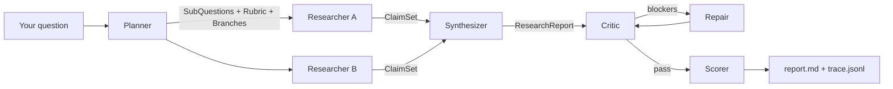
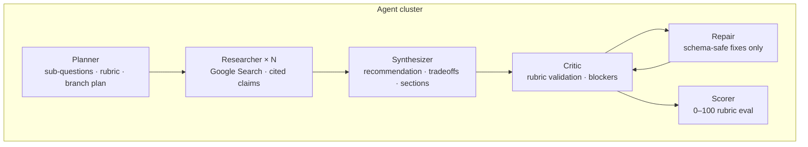
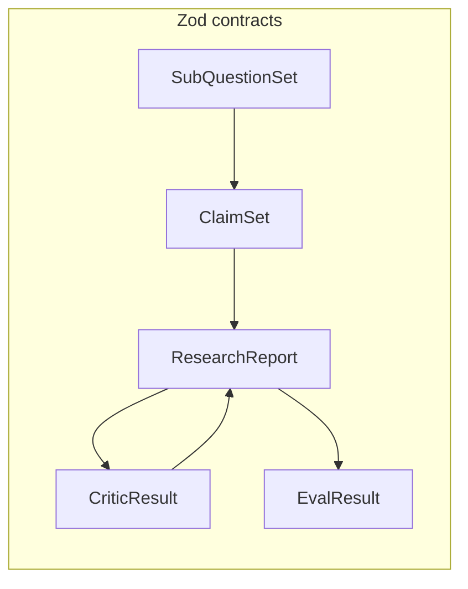
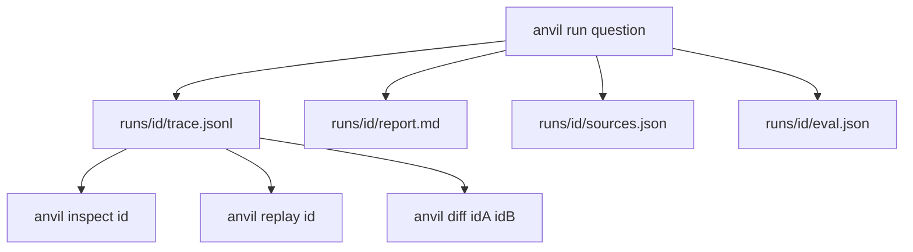

# Anvil

**Agentic research CLI** — typed multi-agent pipelines with grounded citations, replay, and eval.

Ask a technical question in plain language. Anvil decomposes it, researches in parallel with **Gemini + Google Search grounding**, synthesizes a decision-ready report, self-critiques, scores the run, and writes everything to disk as a replayable event log.

```bash
npm install && cp .env.example .env
npm run dev
› Should we use Redis or Postgres pub/sub for a NestJS event bus?
```

---

Anvil is built like a **small production agent system**:

| Idea                  | What it means                                                    |
| --------------------- | ---------------------------------------------------------------- |
| **Typed contracts**   | Agents exchange Zod-validated JSON artifacts, not chat           |
| **Grounded research** | Researcher agents use Gemini + Google Search with real citations |
| **Parallel branches** | Multiple research angles run concurrently, then merge            |
| **Critic → repair**   | Blockers trigger a focused repair pass, not blind retry          |
| **Eval harness**      | Every run gets a rubric score + citation coverage                |
| **Event sourcing**    | `trace.jsonl` logs every step — inspect, replay, diff            |

---

## How it works

### Pipeline



### Agent responsibilities



### Data flow (typed artifacts)



Each handoff is validated. If JSON fails schema checks, a **repair agent** fixes the artifact — not a generic “try again”.

### Event-sourced runs



---

## CLI

### Interactive mode (default)

Like Gemini CLI or Claude Code — type your question at the prompt:

<p align="center">
  
</p>

```text
Anvil — agentic research
Type a technical question and press Enter. Commands start with /
  branches 2  ·  budget $0.50  ·  depth quick
  /help  /runs  /report [id]  /exit  ·  Ctrl+C to quit

› Expo Router vs React Navigation for a new app?
```

### Run progress

<p align="center">
  
</p>

```text
✔ [1] planner
✔ [2] researcher
✔ [3] synthesizer
✔ [4] critic — passed
✔ [5] scorer — score 100
```

### Report output

The full report prints in-terminal when the run completes (or use `--quiet` to skip):

<p align="center">
  
</p>

See [`examples/sample-run/`](examples/sample-run/) for a committed artifact set, or [`docs/screenshots/`](docs/screenshots/) for terminal captures.

---

## Quick start

**Requirements:** Node 20+, free [Gemini API key](https://aistudio.google.com/apikey)

```bash
git clone https://github.com/asimbhdr96/anvil.git
cd anvil
npm install
cp .env.example .env
# set ANVIL_GEMINI_API_KEY in .env

# Interactive (default)
npm run dev

# One-shot
npm run dev -- run "Should we use Redis or Postgres pub/sub for a NestJS event bus?"

# Fewer API calls on free tier
npm run dev -- run "your question" --branches 1 --budget 0.15 --depth quick
```

---

## Commands

| Command                       | Description                                    |
| ----------------------------- | ---------------------------------------------- |
| `anvil`                       | Interactive prompt (default)                   |
| `anvil chat`                  | Same as above                                  |
| `anvil run "<question>"`      | One-shot research                              |
| `anvil run --quiet "<q>"`     | Save report to disk only                       |
| `anvil report <runId>`        | Print a saved report                           |
| `anvil runs`                  | List recent runs                               |
| `anvil inspect <runId>`       | Show pipeline steps                            |
| `anvil inspect <id> --step 3` | Dump step input/output JSON                    |
| `anvil replay <runId>`        | Re-run from synthesizer using stored artifacts |
| `anvil diff <idA> <idB>`      | Compare two runs                               |
| `anvil eval <runId>`          | Re-score an existing run                       |

**Interactive slash commands:** `/help` · `/runs` · `/report [id]` · `/exit`  
**Ctrl+C** quits immediately (including mid-run).

---

## Run artifacts

Every run writes to `runs/<id>/`:

| File           | Purpose                                    |
| -------------- | ------------------------------------------ |
| `report.md`    | Recommendation, tradeoffs, cited sections  |
| `trace.jsonl`  | Event-sourced log (replay source of truth) |
| `run.json`     | Metadata — question, cost, score, status   |
| `sources.json` | Deduped citations from grounding           |
| `eval.json`    | Rubric pass/fail + coverage metrics        |

---

## Configuration

| Variable               | Default            | Description                        |
| ---------------------- | ------------------ | ---------------------------------- |
| `ANVIL_GEMINI_API_KEY` | —                  | **Required.** Google AI Studio key |
| `ANVIL_GEMINI_MODEL`   | `gemini-2.5-flash` | Model id                           |
| `ANVIL_RUNS_DIR`       | `./runs`           | Artifact output directory          |

**Free tier note:** Gemini free tier has daily request limits (~20/day for `gemini-2.5-flash`). Anvil uses ~5–7 API calls per run. Use `--branches 1` to reduce usage.

---

## Project structure

```text
anvil/
├── src/
│   ├── cli.ts              # Commander entry
│   ├── repl.ts             # Interactive prompt loop
│   ├── orchestrator.ts     # Pipeline + branch fan-out
│   ├── agents/             # planner · researcher · synthesizer · critic · scorer
│   ├── contracts.ts        # Zod schemas (agent API)
│   ├── provider/gemini.ts  # Gemini + Google Search grounding
│   └── runstore.ts         # trace.jsonl + artifacts
├── examples/sample-run/    # Committed demo artifacts
└── docs/screenshots/       # CLI terminal captures
```

---

## Development

```bash
npm run dev          # interactive CLI (tsx)
npm run build        # bundle to dist/
npm run typecheck
npm start            # node dist/cli.js
```

---

## License

MIT
